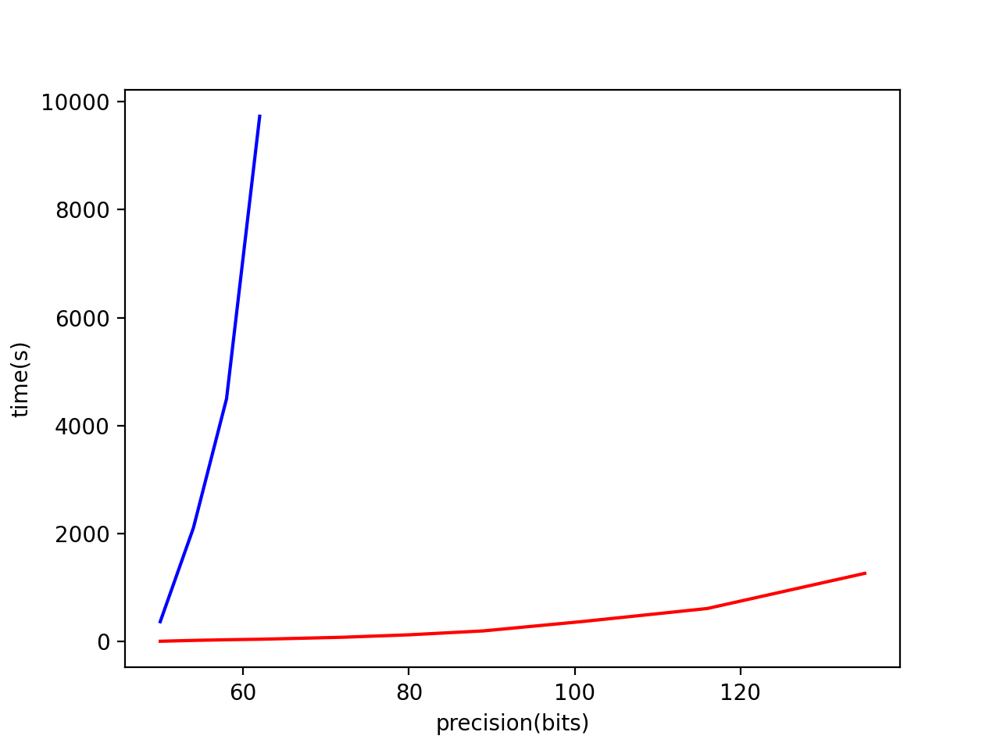

# Experimental results
All experiments were done on a MacBook Pro with 2.8 GHz Quad-Core Intel Core i7 processor and 16 GB RAM using version 12.0.0 of the clang C++ compiler and the latest version of iRRAM.
To also compare to the variant of the algorithm with constant coefficients, we only consider constant matrices but also consider the case where the matrices are given as constant functions.
As the algorithm does not know that the power series is finite, its behaviour should be similar on more complicated functional inputs.

Note that the maximal time interval where we can approximate the solution depends on (the parameters of) the input system and the method we use and the complexity mainly depends on how close we are to the boundary of this interval. 
To make a fair comparison, we therefore evaluated each systems at half of the maximum time that we can conclude from the algorithm.
This in particular means that we use a larger time when we apply the constant method than for the generic method with functional coefficients on the same system.

Some results for the dependency of the running time on the output precision:
For the Cauchy-Kovalevskaya algorithm, the blue line shows the convergence rate of the original algorithm (with variable coefficients); the red one -- the simplified modification for the constant case. 
As expected, the modified version for constant coefficients is significantly more efficient than the general version.
In the general version, the coefficients are given by infinite (multivariate) power series and their evaluation becomes quite cost-intensive for higher precision as many coefficients have to be read.

2D Acoustics 

3D Elasticity 

The original output data can be found in the following files:

[2D Acoustics (constant coefficient method)](./acoustics_const.txt)

[2D Acoustics (variable coefficient method)](./acoustics.txt)

[3D elasticity (constant coefficient method)](./elasticity_const.txt)

[3D elasticity (variable coefficient method)](./elasticity.txt)

[Heat equation outputs](./heat.txt)

